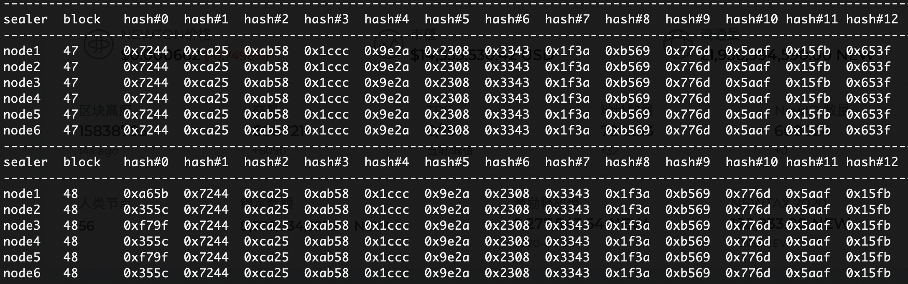

# NewChain Private Network
Deploy tools for newchain private network.

## Installation

* Install the python dependency packages based on python3(>=3.6.2)
```
pip install -r requirements.txt
```
* Compile the newchain binary
```
cd bin && make
```

## Commands and Options
```
Usage:
  ncli.py sealer init <name>
  ncli.py sealer start <name>
  ncli.py sealer startall
  ncli.py sealer stopall
  ncli.py sealer clone <source> <target>
  ncli.py sealer batch init <number>
  ncli.py bootnode start
  ncli.py bootnode stop
  ncli.py clean
  ncli.py monitor
  ncli.py (-h | --help)
  ncli.py --version
Options:
  -h --help     Show this screen.
  --version     Show version.
```
  
* Stop the sealers and boot node, delete the temporary log and configuration files
```
python ncli.py clean
```

* Monitor the status of sealers
```
python ncli.py monitor
```


## Tutorial

### Create the 2-sealers private network

* Start bootnode
```
python ncli.py bootnode start
```

* Initialize the 2 sealers one by one
```
python ncli.py sealer init node1
python ncli.py sealer init node2
```

* Start the sealers
```
python ncli.py sealer startall
```

### Create the 25-sealers private network

* Start bootnode
```
python ncli.py bootnode start
```

* Initialize the 25 sealers
```
python ncli.py sealer batch init 25
```

* Start the sealers
```
python ncli.py sealer startall
```
